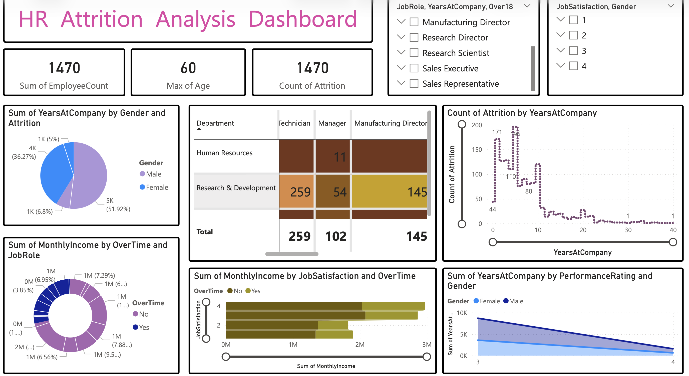
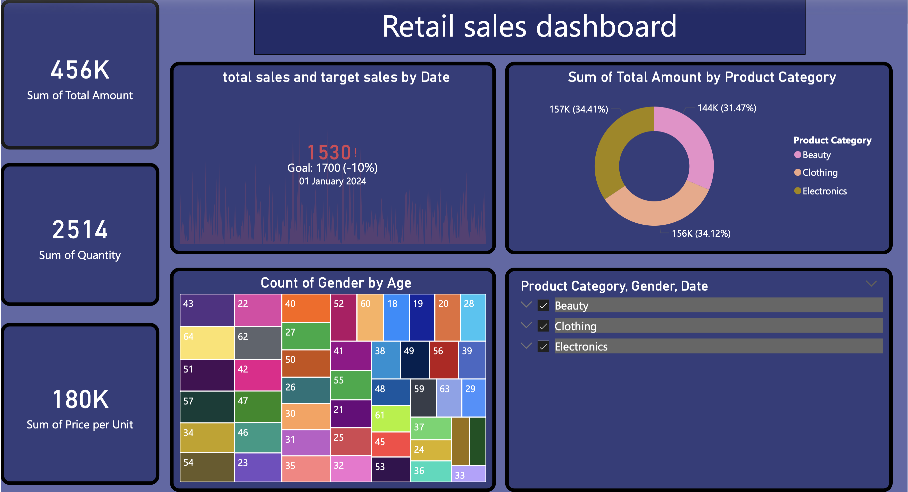
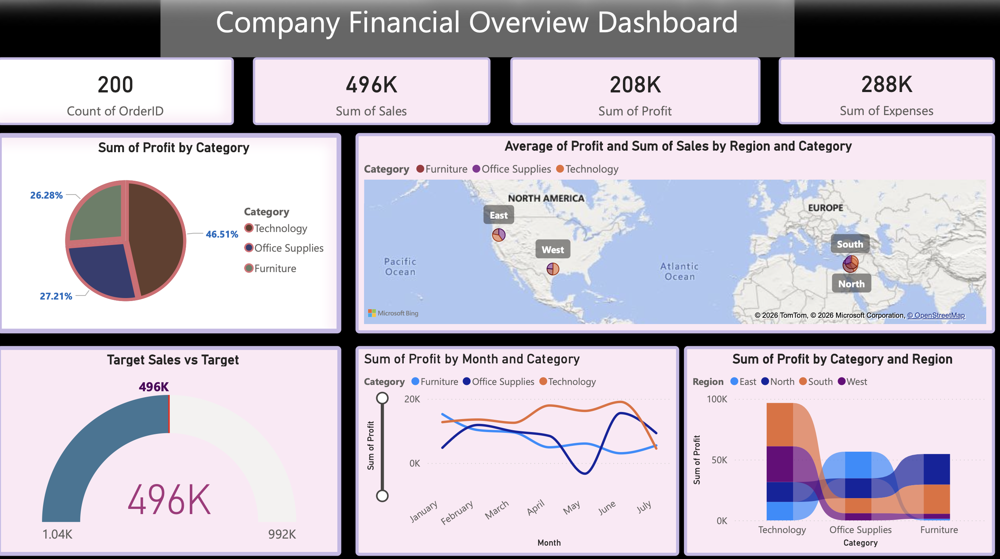

# 📊 Power BI Dashboard Portfolio

## 🔹 Overview

This repository showcases multiple Power BI dashboards created to analyze different business scenarios using data visualization and insights.

## 🔹 Dashboards Included

* 📈 Retail Sales Dashboard
* 👥 HR Attrition Analysis
* 💰 Financial Performance Dashboard
* 🏥 Hospital Patient Analysis

## 🔹 Key Features

* KPI Cards (Sales, Profit, Metrics)
* Interactive filters and slicers
* Trend analysis charts
* Clean and user-friendly dashboard design

## 🔹 Tools Used

* Power BI
* Data Analysis
* Data Visualization

## 🔹 Dashboard Preview

### 📈 Retail Sales Dashboard

### 👥 HR Dashboard

### 💰 Financial Dashboard

## 🔹 Business Insights

* Identified top-performing regions and categories
* Analyzed employee attrition patterns
* Evaluated financial performance trends
* Monitored patient data insights

## 🔹 Purpose

This project demonstrates my ability to create interactive dashboards that help in business decision-making.

## 🔹 Contact

Open for freelancing opportunities 🚀
